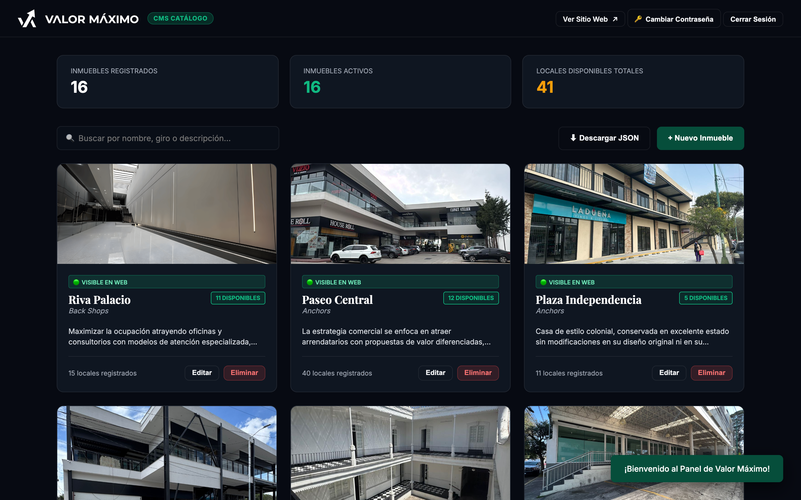
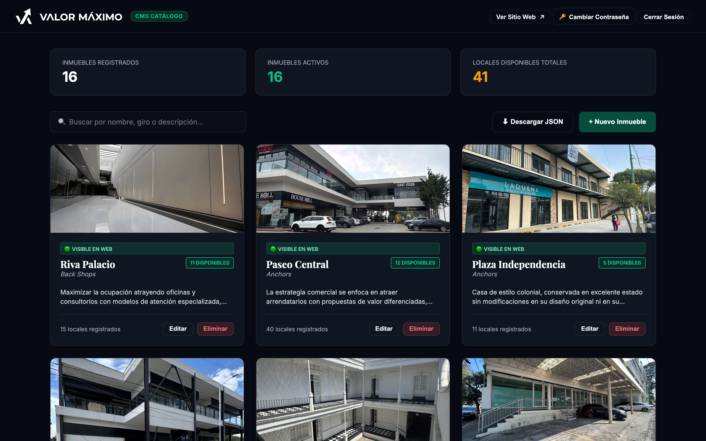
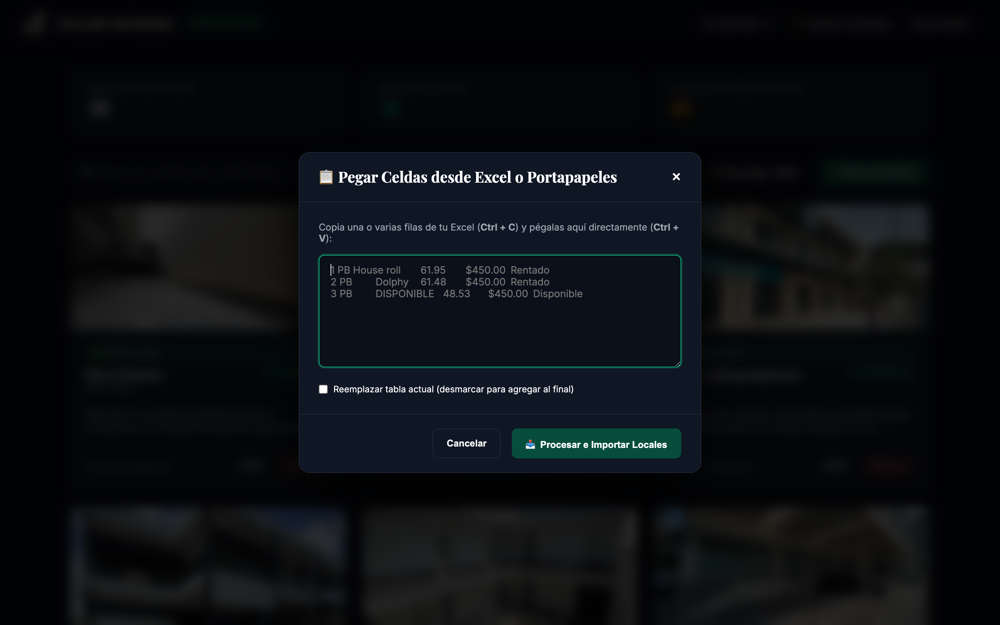
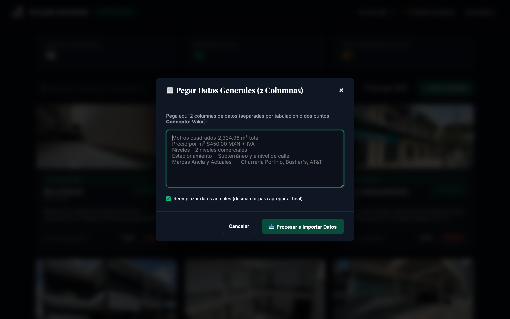
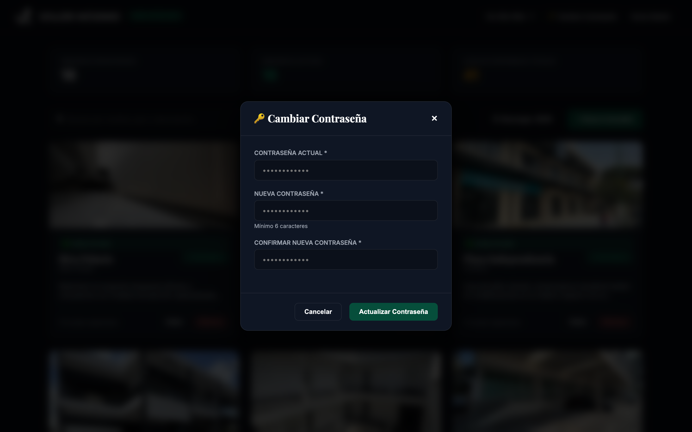

# VALOR MÁXIMO
# MANUAL DE USUARIO & GUÍA OPERATIVA
## Panel de Administración del Catálogo Inmobiliario (CMS)
*Versión 4.0 Definitiva | Con Capturas de Pantalla y Guía Operativa Completa*

---

## 1. Introducción y Acceso al Sistema

El **Panel de Administración** (`admin.html`) es la plataforma central para gestionar el catálogo de plazas y propiedades comerciales de **Valor Máximo**. Toda modificación realizada en este panel se sincroniza en tiempo real con la base de datos en la nube (Supabase) y se refleja de inmediato en el sitio web público.

### 1.1 Pantalla de Inicio de Sesión (Login)
Para ingresar a la consola administrativa:
1. Abra su navegador web y diríjase a la URL: `https://valormaximo.com/admin.html` (o `http://localhost:8085/admin.html` en entorno local).
2. La pantalla cuenta con una animación inmersiva 3D (*DriftWall*) de fondo con obras de la colección *Valor Máximo Art*.
3. Ingrese las credenciales de acceso:
   - **Correo Electrónico**: `admin@valormaximo.com`
   - **Contraseña**: `admin123` *(o su clave personalizada)*
4. Haga clic en **Ingresar al Panel**.

---

## 2. Dashboard Principal y Métricas en Vivo

Al autenticarse, el sistema presenta el centro de mando general con el catálogo completo de inmuebles:

### 2.1 Componentes de la Barra Superior
- **Logotipo de Valor Máximo**: Enlace de identidad corporativa.
- **`+ Nuevo Inmueble`**: Abre el formulario en blanco para registrar una nueva propiedad.
- **`📥 Exportar JSON`**: Descarga una copia de seguridad completa del catálogo con todos los datos e imágenes.
- **`📤 Importar JSON`**: Permite restaurar o migrar el catálogo completo desde un respaldo.
- **`🔑 Cambiar Contraseña`**: Despliega la ventana para actualizar la clave de administrador.
- **`🚪 Salir`**: Cierra la sesión activa de forma segura.

### 2.2 Métricas en Vivo
- **Inmuebles Registrados**: Total de fichas comerciales en el sistema.
- **Inmuebles Activos**: Plazas comerciales visibles actualmente en el portal web público.
- **Locales Disponibles**: Suma acumulada de todos los locales comerciales desocupados (`DISPONIBLE`).

### 2.3 Jerarquía Fija y Tarjetas de Propiedades
- **Plaza Riva Palacio (Fijación Permanente #1)**: Se mantiene siempre en la primera posición del catálogo público y administrativo.
- **Contenido de cada Tarjeta**:
  - Foto de portada en alta definición.
  - Título comercial y dirección física.
  - Estado de publicación: `🟢 Activa` (pública) o `⚪ Inactiva` (borrador privado).
  - Badge de disponibilidad: `X DISPONIBLES` (verde) o `0 DISPONIBLES` (naranja).
  - Número de locales y metros cuadrados totales.
- **Acciones Rápidas en Tarjeta**:
  - **`✏️ Editar`**: Abre la ventana de configuración integral de la plaza.
  - **`👁️ Activar / Ocultar`**: Alterna la visibilidad pública con 1 solo clic.
  - **`🗑️ Eliminar`**: Borra el inmueble tras confirmación.

---

## 3. Configuración de la Ficha del Inmueble

Al hacer clic en **`+ Nuevo Inmueble`** o **`✏️ Editar`**, se abre la ventana modular organizada en 5 secciones de acceso rápido:

### 3.1 Datos Básicos
- **Nombre del Inmueble**: Nombre comercial de la plaza (ej. *Plaza Riva Palacio*, *Paseo Central*).
- **Estatus**: `🟢 Activa (Visible al público)` o `⚪ Inactiva (Borrador)`.
- **Estatus / Badge**:
  - *Automático*: Calculado en tiempo real según los locales vacantes en la tabla.
  - *Personalizado*: Opciones como *100% Ocupado*, *Próxima Apertura*, *Preventa*, etc.
- **Tipo de Propiedad**: Plaza Comercial, Strip Mall, Centro Comercial, Local Individual, Nave / Bodega o Terreno Comercial.
- **Descripción Comercial**: Resumen de atributos, ventajas geográficas, afluencia vehicular y peatonal.

---

## 4. Galería de Fotografías

### 4.1 Operación de la Galería
1. **Carga desde Equipo**: Haga clic en **`📸 Seleccionar Fotos desde tu Equipo`** para seleccionar múltiples imágenes (JPG, PNG, WEBP).
2. **Extracción desde Documentos**: Al arrastrar un archivo Word o PDF al dropzone, todas las fotos incrustadas se extraen y se integran automáticamente.
3. **Selección de Portada Principal (★)**: Haga clic en el icono de estrella sobre cualquier foto para asignarla como la imagen principal de la tarjeta en el catálogo.
4. **Eliminación**: Pulse la **×** roja en la esquina superior de cualquier fotografía para descartarla.

---

## 5. Ubicación y Google Maps Interactivo con Live Preview

### 5.1 Entrada Universal de Enlaces
Pegue cualquier tipo de enlace o código de Google Maps en el campo **Ubicación Google Maps**:
- **Enlaces cortos**: `https://maps.app.goo.gl/...`
- **URLs completas**: `https://www.google.com/maps/place/...`
- **Coordenadas GPS**: `19.28456, -99.65432`
- **Código HTML**: `<iframe src="..."></iframe>`

### 5.2 Previsualización Interactiva en Vivo
El sistema detecta automáticamente las coordenadas y despliega de inmediato la ventana interactiva del mapa satelital/urbano mostrando el pin exacto antes de guardar.

---

## 6. Locales y Espacios Comerciales (Tabla de 4 Columnas)

### 6.1 Estructura Oficial de Columnas
| No. Local | Giro / Inquilino | Superficie (m²) | Precio |
| :--- | :--- | :--- | :--- |
| **1 PB** | House Roll | 61.95 | $450.00 |
| **2 PB** | Helados Dolphy | 61.48 | $450.00 |
| **3 PB** | DISPONIBLE | 50.00 | $450.00 |

### 6.2 Métodos de Captura
- **`+ Agregar 1 Local`**: Inserta una nueva fila vacía.
- **`📋 Pegar Celdas`**: Abre la ventana para pegar un rango de celdas copiadas directamente desde Excel.
- **`📥 Plantilla Excel`**: Descarga la plantilla oficial prellenada con las 2 hojas (*Locales* y *Datos Generales*).
- **Cálculo Automático de Disponibilidad**: Cualquier fila que tenga la palabra **`DISPONIBLE`** en la columna *Giro* suma automáticamente al contador de vacantes y actualiza el badge de la plaza.

---

## 7. Datos Generales y Ficha Técnica (Tabla de 2 Columnas)

Ubicada inmediatamente debajo de la tabla de locales. Permite registrar las características físicas, normativas y operativas de la plaza:

### 7.1 Estructura Oficial (2 Columnas)
| Concepto / Característica | Valor / Descripción |
| :--- | :--- |
| **Superficie Total de Terreno** | 3,500.00 m² |
| **Superficie Construida** | 2,450.00 m² |
| **Niveles Comerciales** | 2 niveles (Planta Baja y Planta Alta) |
| **Cajones de Estacionamiento** | 65 cajones en sótano y exterior |
| **Marcas Ancla** | Starbucks, OXXO, Farmacias del Ahorro |
| **Uso de Suelo** | Comercial y Servicios |
| **Seguridad y Vigilancia** | Circuito cerrado CCTV 24/7 y acceso controlado |
| **Servicios e Instalaciones** | Subestación eléctrica, cisterna 50,000L, elevador |

### 7.2 Métodos de Captura
- **`+ Agregar 1 Dato`**: Añade una fila para captura manual.
- **`📋 Pegar Datos`**: Abre el modal de pegado rápido para insertar 2 columnas desde Excel o formato `Concepto: Valor`.
- **Auto-Extracción**: El dropzone lee automáticamente estas especificaciones desde hojas de Excel, tablas Word o párrafos PDF.

---

## 8. Guía de Importación por Tipo de Documento

El **Dropzone** procesa archivos arrastrados o seleccionados de manera unificada:

1. **Excel (`.xlsx`, `.xls`, `.csv`)**:
   - Procesa archivos con 2 hojas: **Hoja 1 (`Locales`)** y **Hoja 2 (`Datos Generales`)**.
   - Si el archivo contiene una sola hoja, divide automáticamente las filas de locales (4 col) y ficha técnica (2 col).
2. **Word (`.docx`)**:
   - Convierte tablas de 2 columnas en Ficha Técnica y tablas de 3+ columnas en Locales.
   - Analiza párrafos tipo `Concepto: Valor` para llenar especificaciones.
   - Extrae e inserta en la galería todas las fotos incrustadas en HD.
3. **PDF (`.pdf`)**:
   - Extrae tablas de locales, datos generales en texto y todas las fotos incrustadas.

---

## 9. Seguridad y Cambio de Contraseña

1. En la barra superior, pulse **`🔑 Cambiar Contraseña`**.
2. Ingrese su nueva clave en el campo correspondiente y pulse **Guardar Contraseña**.
3. La nueva credencial tendrá efecto inmediato para los siguientes inicios de sesión.

---

## 10. Respaldo de Información (Exportar / Importar JSON)
- **Exportar Respaldo**: Pulse **`📥 Exportar JSON`** para generar el archivo `catalogo_valormaximo.json`.
- **Restaurar Respaldo**: Pulse **`📤 Importar JSON`** y seleccione su archivo de respaldo para restaurar todo el catálogo con 0ms de pérdida.

---
*Manual Oficial de Operación | Valor Máximo CMS v4.0*
